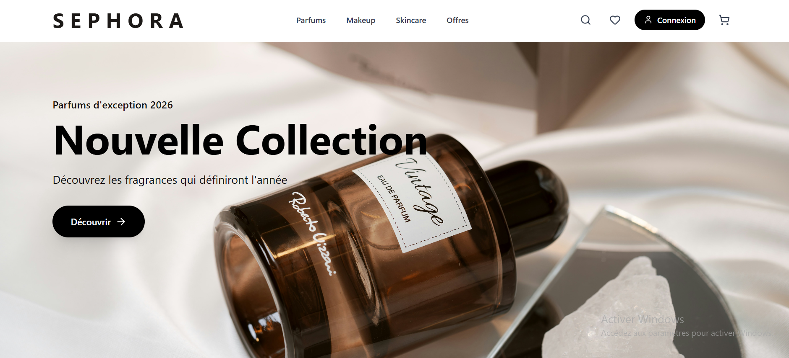

# 🛍️ Sephora Clone - E-commerce Full-Stack


> Application e-commerce moderne avec interface client complète et backoffice d'administration sécurisé par Firebase Authentication.

---

## 🌟 Démonstration

**🔗 [Voir la démo en ligne](https://sephora-4d92b.web.app)**

---

## 📸 Aperçu

<div align="center">
  
  <p><i>Interface client moderne et responsive</i></p>
</div>


---

## ✨ Fonctionnalités Principales

### 👥 Espace Client
- ✅ **Catalogue de 30+ produits** (Parfums, Makeup, Soins)
- ✅ **Recherche avancée** avec filtres par catégorie, marque et prix
- ✅ **Panier d'achat** avec gestion des quantités et persistance
- ✅ **Système de favoris** synchronisé
- ✅ **Design responsive** mobile-first avec animations

### 🔐 Authentification & Administration
- ✅ **Firebase Authentication** pour connexion sécurisée
- ✅ **Protection des routes** avec redirection automatique
- ✅ **Dashboard admin** moderne avec navigation intuitive
- ✅ **Gestion de sessions** persistantes
- ✅ **CRUD complet** sur 3 collections Firebase
- ✅ **Gestion des produits** (création, modification, suppression)
- ✅ **Upload d'images** via Cloudinary
- ✅ **Gestion des stocks** en temps réel

---

## 🛠️ Stack Technique

**Frontend**
- React 18 avec Hooks
- React Router v6
- Context API (gestion d'état)
- TailwindCSS + Lucide Icons
- Vite (build tool)

**Backend & Services**
- Firebase Authentication (connexion sécurisée)
- Firebase Firestore (base de données)
- Firebase Hosting (déploiement)
- Cloudinary (CDN images)

---

## 🔐 Authentification & Accès Administration

L'application utilise **Firebase Authentication** pour sécuriser l'accès à l'interface d'administration.


Une fois connecté, accédez au dashboard d'administration (`/admin-dashboard`) avec :

- ✅ **Dashboard centralisé** - Vue d'ensemble et navigation
- ✅ **Gestion Parfums** - CRUD complet sur la collection products
- ✅ **Gestion Makeup** - CRUD complet sur la collection makeup
- ✅ **Gestion Soins** - CRUD complet sur la collection skincare
- ✅ **Upload d'images** - Via Cloudinary avec optimisation
- ✅ **Gestion des stocks** - Suivi en temps réel
- ✅ **Import en masse** - Produits de démonstration
- ✅ **Protection des routes** - Redirection automatique si non authentifié
- ✅ **Sessions sécurisées** - Gestion automatique par Firebase

### Architecture de Sécurité

```
┌─────────────────────────────────────┐
│  Firebase Authentication            │
│  (Tokens JWT sécurisés)            │
└──────────────┬──────────────────────┘
               ↓
┌─────────────────────────────────────┐
│  Protection des Routes React        │
│  (ProtectedRoute Component)        │
└──────────────┬──────────────────────┘
               ↓
┌─────────────────────────────────────┐
│  Règles Firestore                   │
│  (write: si authentifié)           │
└──────────────┬──────────────────────┘
               ↓
┌─────────────────────────────────────┐
│  Interface Admin Sécurisée          │
└─────────────────────────────────────┘
```

> 💡 **Note :** En production, un système de rôles serait implémenté (admin, modérateur, éditeur) avec des permissions granulaires par collection.

---

## 🚀 Installation Rapide

### Prérequis

```bash
Node.js >= 18.0.0
npm >= 9.0.0
```

### Étape 1 : Cloner le projet

```bash
git clone https://github.com/votre-username/sephora-clone.git
cd sephora-clone
```

### Étape 2 : Installer les dépendances

```bash
npm install
```

### Étape 3 : Configuration Firebase

1. Créez un projet sur [Firebase Console](https://console.firebase.google.com)
2. Activez **Authentication** (Email/Password)
3. Activez **Firestore Database**
4. Activez **Hosting**
5. Créez un fichier `.env` à la racine :

```env
VITE_FIREBASE_API_KEY=votre_api_key
VITE_FIREBASE_AUTH_DOMAIN=votre_auth_domain
VITE_FIREBASE_PROJECT_ID=votre_project_id
VITE_FIREBASE_STORAGE_BUCKET=votre_storage_bucket
VITE_FIREBASE_MESSAGING_SENDER_ID=votre_sender_id
VITE_FIREBASE_APP_ID=votre_app_id
VITE_CLOUDINARY_CLOUD_NAME=votre_cloud_name
```

### Étape 4 : Créer un compte admin

Via **Firebase Console** → **Authentication** → **Users** → **Add user** :
```
Email : admin@sephora.com
Password : demo2024
```

### Étape 5 : Lancer le projet

```bash
npm run dev
```


## 📂 Structure du Projet

```
src/
├── Components/          # Composants React
│   ├── Navbar.jsx      # Navigation
│   ├── Products.jsx    # Catalogue parfums
│   ├── Makeup.jsx      # Catalogue makeup
│   ├── Skincare.jsx    # Catalogue soins
├── pages/              # Pages principales
│   ├── Home.jsx        # Accueil
│   ├── AdminLogin.jsx  # Connexion admin
│   ├── Search.jsx      # Recherche
│   ├── Panier.jsx      # Panier
│   └── Favoris.jsx     # Favoris
├── context/            # Context API
│   ├── AuthContext.jsx      # Authentification
│   ├── CartContext.jsx      # Panier
│   └── FavoritesContext.jsx # Favoris
└── firebase.js         # Config Firebase
```

---

## 🎯 Points Forts Techniques

### Architecture
- ✅ Application full-stack complète (Frontend + Backend)
- ✅ Authentification Firebase avec gestion de sessions
- ✅ Protection des routes React Router
- ✅ Séparation claire des responsabilités

### Gestion d'État
- ✅ Context API pour le state global (auth, panier, favoris)
- ✅ Persistance avec localStorage
- ✅ Synchronisation temps réel

### Sécurité
- ✅ Authentification Firebase (tokens JWT)
- ✅ Routes protégées côté client
- ✅ Règles Firestore côté serveur
- ✅ Validation des inputs

### Optimisation
- ✅ Images optimisées via Cloudinary
- ✅ Lazy loading des composants
- ✅ Code splitting avec React Router

---

## 📊 Statistiques

- 📦 **Composants React :** 25+
- 🗄️ **Collections Firestore :** 3
- 🛍️ **Produits gérés :** 30+
- 📄 **Pages :** 12
- 💻 **Lignes de code :** ~5,000
- 🔐 **Système d'authentification :** Firebase Auth

---

## 🧪 Tester l'Application

### Espace Client
1. Allez sur [https://sephora-4d92b.web.app](https://sephora-4d92b.web.app)
2. Naviguez dans les produits
3. Ajoutez au panier et aux favoris
4. Testez la recherche


## 🎓 Compétences Démontrées

**Frontend**
- Développement d'interfaces React modernes
- Gestion d'état avec Context API
- Routage avec React Router
- Design responsive avec TailwindCSS
- Protection des routes et authentification

**Backend**
- Intégration Firebase Authentication
- Firebase Firestore (CRUD complet)
- Règles de sécurité Firestore
- Gestion de sessions utilisateurs
- Déploiement en production

**DevOps**
- Déploiement Firebase Hosting
- Configuration des variables d'environnement
- Gestion de version avec Git

---

## 🚀 Déploiement

**Production :** [https://sephora-4d92b.web.app](https://sephora-4d92b.web.app)

```bash
# Build de production
npm run build

# Déployer sur Firebase
firebase deploy
```

---

## 🔄 Évolutions Futures

- [ ] Système de paiement (Stripe)
- [ ] Multi-rôles admin (admin, modérateur, éditeur)
- [ ] Recommandations personnalisées (IA)
- [ ] Progressive Web App (PWA)
- [ ] Tests automatisés (Jest, Cypress)
- [ ] Dashboard analytics admin
- [ ] Notifications en temps réel

---

## 👨‍💻 Auteur

**[Mekid Asma hayet]**

📧 Email : mekidasmaahayat1l@gmail.com 
💼 LinkedIn : https://www.linkedin.com/in/mekid-asmaa-hayat-014850222/


---

## 📄 Licence

Ce projet est sous licence Apache 2.0 
---

## ⭐ Support

Si ce projet vous a plu ou vous a été utile, n'hésitez pas à laisser une ⭐ sur le repo !

---

<div align="center">
  
**Application web développée avec React**


[⬆ Retour en haut](#-sephora-clone---e-commerce-full-stack)

</div>
